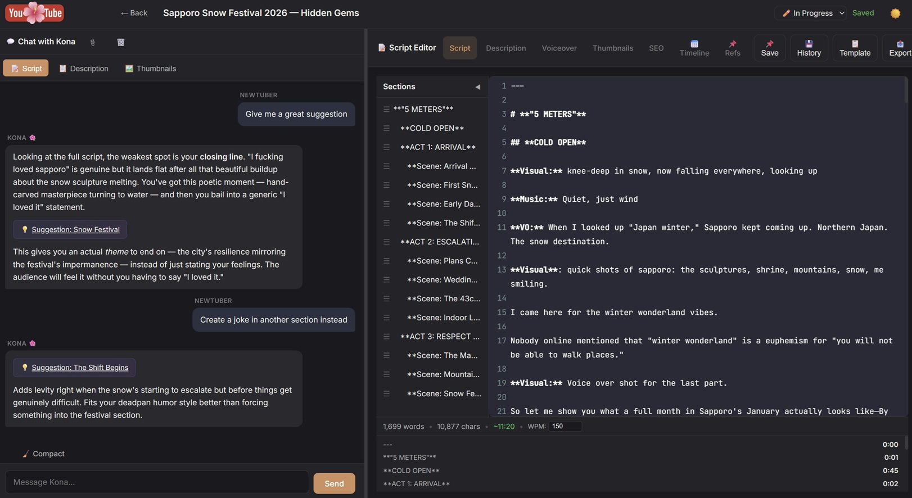
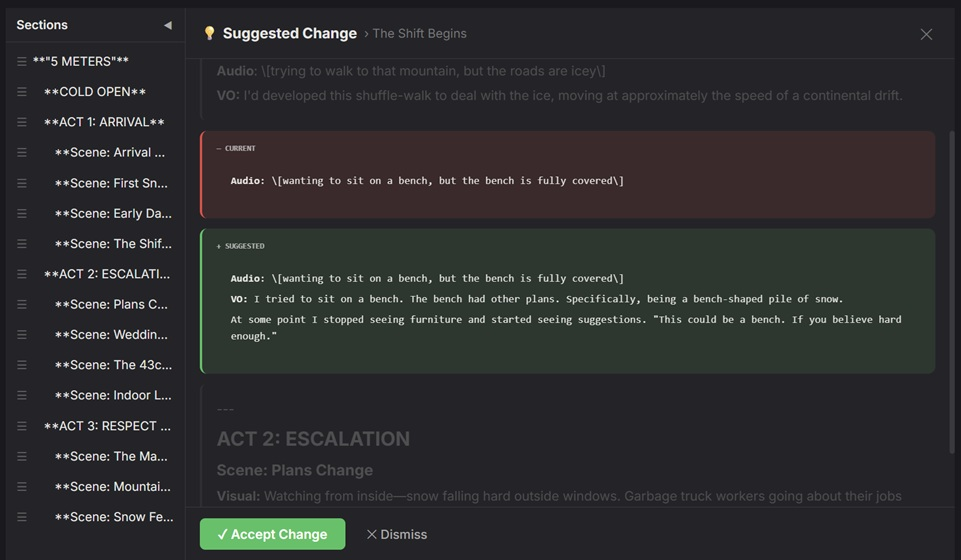
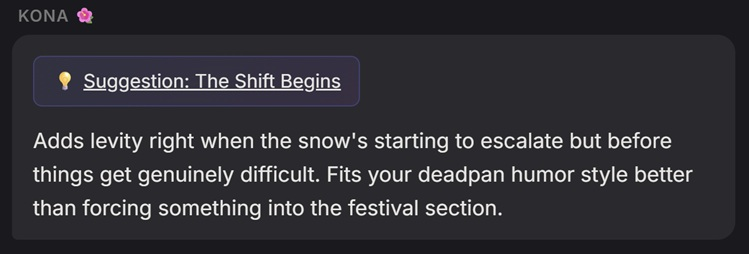
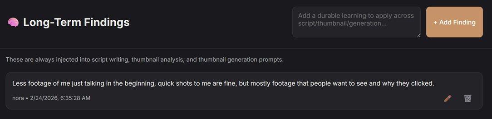

<p align="center">
  
</p>

<h1 align="center">YAA — YouTube AI Assistant</h1>
<p align="center">
  <strong>A local-first creative workspace for YouTube creators.</strong><br/>
  Write scripts, iterate on thumbnails, manage descriptions — all with an AI copilot that actually remembers what you're working on.
</p>

<p align="center">
  
  
  
</p>

---

## Why YAA?

Making YouTube videos means juggling scripts, descriptions, voiceover notes, thumbnails, and a dozen browser tabs. Most AI tools treat each of those as a separate conversation — so the AI forgets your video context the moment you switch tasks.

YAA keeps everything in one place. Your script, your description, your thumbnails, and your AI chat all live inside the same project. When the AI helps you punch up a script line, it already knows your thumbnail direction and video description. When you iterate on a thumbnail, it already knows the script's hook.

Everything runs on your machine. Your scripts, your ideas, your API keys — none of it leaves your computer.

---

## What It Looks Like

### Script Writer — Your Main Workspace
The script editor with AI chat, live word count, timing estimates, and a draggable section outline — all in one view.



### Inline Suggestions — Git-Diff Style
When the AI suggests a rewrite, you see the old and new text side by side. One click to accept, one click to reject.



### Chat Suggestions
Hit the suggestion button and the AI drafts concrete changes, not vague advice.



### Long-Term Findings
Creative rules that persist across every project. "Less talking head in the intro" or "always lead with the payoff" — add it once, and the AI applies it everywhere.



---

## Features at a Glance

### 📝 Script Writing
- **Rich markdown editor** with syntax highlighting (powered by CodeMirror)
- **Four content tabs** per video: Script, Description, Voiceover Notes, Thumbnail Ideas
- **Live timing widget** — word count, character count, and estimated video duration at your speaking pace (configurable WPM)
- **Per-section timing** — see how long each section of your script will take to deliver
- **Draggable section outline** — reorder your script sections by drag-and-drop and jump to any section instantly
- **Dark mode and light mode**

### 🤖 AI Chat That Stays in Context
- **Three dedicated chat channels** per video — Script, Description, and Thumbnail — each focused on its own job
- **Cross-channel awareness** — the Script chat knows what's happening in the Thumbnail chat, and vice versa
- **Inline suggestions** — the AI produces diff-style "old → new" blocks you can accept or reject with one click, written directly into your editor
- **Conversation memory** — long chats are automatically summarized so the AI never loses context, even after hundreds of messages
- **Token tracking** — see how much context you're using, with manual compaction when you want to free up space
- **Streaming responses** — answers appear in real-time as the AI writes them

### 🎨 Thumbnail Studio
- **Upload and version thumbnails** with a clean major.minor versioning system (v1.0 → v1.1 → v2.0)
- **AI-powered analysis** — upload a thumbnail and get a detailed breakdown of what's working and what isn't (using vision models)
- **One-click "Improve"** — analyzes your current thumbnail, builds an optimization plan, and generates a new AI-created variation automatically
- **Generate from scratch** — describe what you want and get AI-generated thumbnails without uploading anything
- **Subversion tracking** — see the parent-child lineage of every thumbnail iteration
- **Thumbnail Research Bible** — write a markdown file with your personal thumbnail rules and the AI uses it as context for every thumbnail decision

### 📌 Long-Term Findings
- **Global creative rules** injected into every AI prompt across all your projects
- Perfect for learnings that should always apply: pacing notes, style preferences, audience insights
- Add, edit, and archive findings from a dedicated panel

### 🎬 Editor Tips & Chat
Built-in support for **five editing apps**: DaVinci Resolve, Premiere Pro, Final Cut Pro, After Effects, and CapCut.

Each editor gets:
- A **tips & tricks tree** — hierarchical, searchable, and editable
- A **dedicated AI chat** with memory, tuned for editing workflow questions
- **RAG-powered context** — YAA fetches and chunks official documentation, so the AI's editing answers are grounded in real docs (falls back to curated best practices if docs aren't reachable)

### 📋 Templates
- **Pre-built starting structures**: Vlog, Tutorial, Documentary
- **Create templates from any video** — capture a script structure you like and reuse it
- **Apply templates** to instantly scaffold a new project with structure

### 📸 Version History
- **Script snapshots** — save the state of your entire project at any point
- **Restore** any previous snapshot with one click
- **Diff between snapshots** — compare two versions to see what changed

### 📎 Reference Board
- Attach **links, images, and notes** to any video project
- Keep research, inspiration, and references right next to your script

### 📤 Export
Export your work in the format you need:

| Format | What You Get |
|---|---|
| **Text** | Clean plain text |
| **Markdown** | Formatted with metadata and status |
| **PDF** | Polished A4 document with titled sections |
| **JSON** | Full project data — chat history, snapshots, thumbnails, memory, everything |
| **YouTube-ready** | Script with all markdown stripped, ready to paste into YouTube Studio |

### 🔐 Privacy-First
- **100% local** — everything runs on your machine in a local SQLite database
- **API keys stay in your `.env`** — sent only to the provider you chose, nothing else
- **No telemetry, no analytics, no cloud sync**

---

## Supported AI Providers

Use one provider, use several, or run fully local with Ollama. Mix and match as you like.

| What For | Supported Providers |
|---|---|
| **Text & chat** | Claude (Anthropic) · OpenAI · Grok (xAI) · Gemini (Google) · OpenRouter · Ollama (local) |
| **Image analysis** | Claude Vision · Gemini Vision · Grok Vision · OpenRouter Vision |
| **Image generation** | Gemini Image · Grok Vision · OpenRouter / Nanobanana |

Every provider includes **automatic model fallback** — if a model errors out, YAA tries the next one in your list automatically. Model lists are fetched live from each provider's API.

---

## Quick Start

**Prerequisites:** Node.js 18+ and at least one API key (or a local Ollama instance).

```bash
git clone https://github.com/Pmobilee/Youtube-AI-Assistant.git
cd Youtube-AI-Assistant
npm install
cp .env.example .env
```

Open `.env` and add at least one API key, then:

```bash
npm start
```

Open **http://127.0.0.1:3000** — you're done.

For development with auto-reload: `npm run dev`

### First-Run Setup

Open **⚙️ Settings** (top right) and configure:

1. **Your name** — the AI uses it to personalize its responses
2. **Editing app** — DaVinci Resolve, Premiere Pro, Final Cut Pro, After Effects, or CapCut
3. **API keys** — add keys for the providers you want to use (you only need one)
4. **Models** — pick your preferred text model, image analysis model, and image generation model

All settings persist locally and can be changed anytime.

---

## Running Fully Local with Ollama

Want text generation without sending anything to the cloud?

1. [Install Ollama](https://ollama.com)
2. Pull a model: `ollama pull llama3.1:8b`
3. In YAA Settings, set the text provider to **Ollama (Local)**
4. The base URL defaults to `http://127.0.0.1:11434` — change it if needed

YAA auto-detects your available Ollama models. Note: image analysis and generation still need a cloud API — Ollama handles text only.

---

## How the AI Suggestions Work

When you ask the AI to improve part of your script, it doesn't just describe what to change — it produces structured blocks that render as visual diffs in the UI:

```
<<<SUGGEST tab="script" section="Hook">>>
---OLD---
So today we're going to talk about something interesting.
---NEW---
Last week, a 14-year-old beat every chess grandmaster on the planet. Here's how.
<<<END_SUGGEST>>>
```

This shows up as a side-by-side diff card with **Accept** and **Reject** buttons. Accepting writes the change directly into your editor. The AI can include multiple suggestions in a single response, each targeting a different tab (script, description, voiceover, or thumbnails).

---

## How Context Memory Works

YAA manages AI context automatically so long sessions never hit a wall:

- **Per-video memory** — each project tracks its own conversation summary, key decisions, and style notes
- **Auto-summarization** — when a chat grows long (50+ messages or 250K+ estimated tokens), older messages are summarized and compressed automatically
- **Manual compaction** — trigger a cleanup anytime from the UI when you want to slim down context
- **Global memory** — cross-project preferences and patterns persist in a separate file
- **Long-term findings** — creative rules applied to every AI interaction in every project

---

## Assistant Personality (Env-Driven)

YAA does **not** ship with a built-in persona. The assistant identity and voice are configured via `.env` and injected into system prompts at runtime. This keeps the app generic and lets every user define their own copilot.

**Keys:**
- `YAA_ASSISTANT_NAME` — display name used in prompts + UI (default: `Assistant`)
- `YAA_ASSISTANT_EMOJI` — optional emoji used in the UI (default: `🤖`)
- `YAA_ASSISTANT_PERSONALITY` — high-level traits and tone (inserted into prompts)
- `YAA_ASSISTANT_COMMUNICATION` — response rules (brevity, formatting, behavior)
- `YAA_CREATOR_PROFILE` — short user profile/context to guide responses

**Example:**
```env
YAA_ASSISTANT_NAME=Assistant
YAA_ASSISTANT_EMOJI=🤖
YAA_ASSISTANT_PERSONALITY=Direct, practical, creator-focused. Give actionable guidance and challenge weak ideas.
YAA_ASSISTANT_COMMUNICATION=Keep replies concise, specific, and useful. Prefer bullets and concrete next steps over long prose.
YAA_CREATOR_PROFILE=Creator profile: makes YouTube videos and prefers practical, iterative collaboration.
```

---

## Thumbnail Research Bible

Give the AI persistent knowledge about your thumbnail style by creating `data/thumbnail_research_bible.md`. This gets injected into every thumbnail-related AI interaction.

An example file is included at `data/thumbnail_research_bible.example.md`:

```markdown
# Thumbnail Research Bible

## Hook rules
- Keep message obvious in <2 seconds.
- Prioritize one clear visual idea per thumbnail.

## Composition
- Strong subject separation from background.
- High-contrast text only when needed.

## Iteration checklist
- What changed vs previous version?
- Is the promise truthful to video content?
- Would this still read on mobile?
```

Rename it to `thumbnail_research_bible.md` and make it yours.

---

## Project Structure

```
├── server.js                 # Entry point
├── src/
│   ├── app.js                # Express app, all routes, AI logic, DB schema
│   ├── config/paths.js       # Path resolution
│   ├── routes/               # Modular route handlers (findings)
│   └── services/             # Model state service
├── public/
│   ├── index.html            # Single-page app shell
│   ├── js/app.js             # Frontend logic (editor, chat, thumbnails)
│   ├── js/davinci.js         # Editor tips & chat UI
│   └── css/style.css         # Full stylesheet with dark/light themes
├── data/                     # SQLite DB, runtime settings, research files
├── scripts/                  # Release packaging
├── .env.example              # Environment variable template
└── package.json
```

---

## Environment Variables

All configuration lives in `.env`. The essentials:

| Variable | Purpose | Default |
|---|---|---|
| `PORT` | Server port | `3000` |
| `ANTHROPIC_API_KEY` | Claude API key | — |
| `OPENAI_API_KEY` | OpenAI API key | — |
| `XAI_API_KEY` | Grok (xAI) API key | — |
| `GEMINI_API_KEY` | Google Gemini API key | — |
| `OPENROUTER_API_KEY` | OpenRouter API key | — |
| `YAA_OLLAMA_BASE_URL` | Ollama server address | `http://127.0.0.1:11434` |
| `YAA_TEXT_PROVIDER` | Default text provider | `anthropic` |
| `YAA_MODEL` | Default text model | `claude-sonnet-4-6` |
| `YAA_EDITOR` | Default editing app | `davinci-resolve` |
| `YAA_ASSISTANT_NAME` | Assistant display name | `Assistant` |
| `YAA_ASSISTANT_EMOJI` | Assistant emoji (optional) | `🤖` |
| `YAA_ASSISTANT_PERSONALITY` | Assistant personality summary | `Direct, practical, creator-focused…` |
| `YAA_ASSISTANT_COMMUNICATION` | Response style rules | `Keep replies concise…` |
| `YAA_CREATOR_PROFILE` | User profile/context | `Creator profile: …` |
| `YAA_THUMBNAIL_RESEARCH_PATH` | Thumbnail research file path | `./data/thumbnail_research_bible.md` |

See `.env.example` for the full list, including per-provider model options, image model settings, and custom API base URLs.

---

## Contributing

Something broken? Want a feature? Open an issue or fork it and ship. YAA is meant to be personal and hackable — the codebase is intentionally straightforward so you can bend it to your workflow.

## License

MIT
